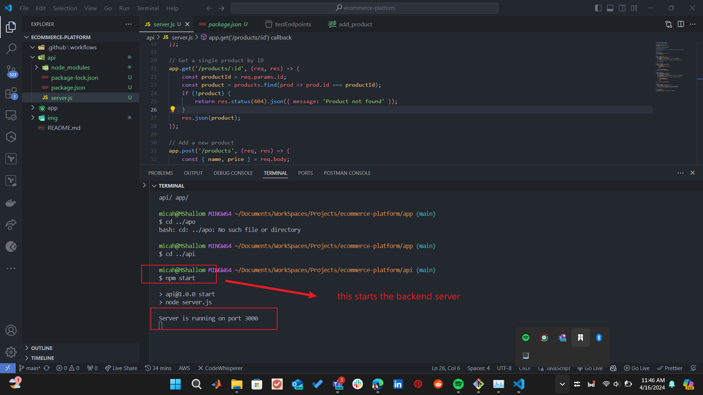
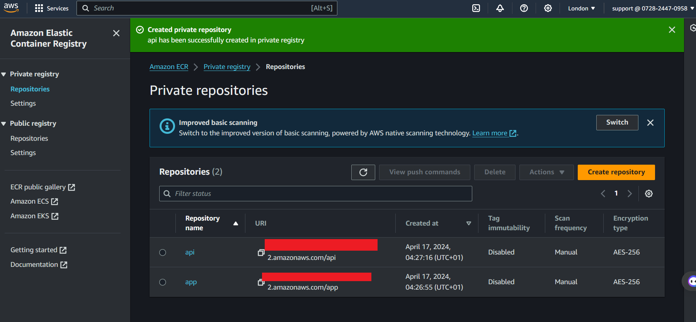
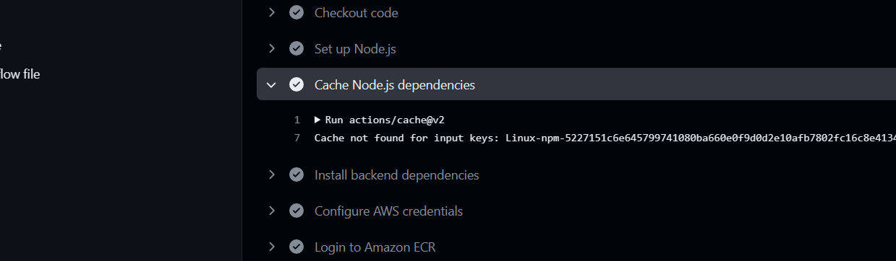

# Capstone Project: Ecommerce Application CI/CD Pipeline
## Ecommerce With Github Actions

## Setting UP
- Go to github and create a repository called `ecommerce-platform`
- Clone the repository on local machine and create two directories 
  - api
  - app
- Both directories are going to contain javascript code with api being the backend and app being the frontend.
  

- Move into the api directory and initialize the directory with `npm init -y`
- Install express `npm install express`. Express is a backend framewrok built on nodejs used for building backend apis

- in the api directory, create a file called `server.js`. This file contains the backend code for the ecommerce application
<pre style="color: white">
  
const express = require('express');
const cors = require('cors');

const app = express();

// Enable CORS for all routes
app.use(cors());

const PORT = process.env.PORT || 4000;

// Middleware to parse JSON bodies
app.use(express.json());

// Dummy database (replace with a real database in a production environment)
let products = [];

// Routes
// Get all products
app.get('/products', (req, res) => {
    res.json(products);
});

// Get a single product by ID
app.get('/products/:id', (req, res) => {
    const productId = req.params.id;
    const product = products.find(prod => prod.id === productId);
    if (!product) {
        return res.status(404).json({ message: 'Product not found' });
    }
    res.json(product);
});

// Add a new product
app.post('/products', (req, res) => {
    const { name, price } = req.body;
    const newProduct = {
        id: String(products.length + 1),
        name,
        price
    };
    products.push(newProduct);
    res.status(201).json(newProduct);
});

// Update a product
app.put('/products/:id', (req, res) => {
    const productId = req.params.id;
    const { name, price } = req.body;
    const productIndex = products.findIndex(prod => prod.id === productId);
    if (productIndex === -1) {
        return res.status(404).json({ message: 'Product not found' });
    }
    products[productIndex] = {
        ...products[productIndex],
        name,
        price
    };
    res.json(products[productIndex]);
});

// Delete a product
app.delete('/products/:id', (req, res) => {
    const productId = req.params.id;
    products = products.filter(prod => prod.id !== productId);
    res.json({ message: 'Product deleted successfully' });
});

// Start the server
module.exports = app.listen(PORT, () => {
    console.log(`Server is running on port ${PORT}`);
});
</pre>

- Now it is time to test the backend server
  

- Install POSTMAN extension on VSCODE to test the backend endpoint

- We will be testing one of the endpoints, the endpoint for adding a product and its price
- On Postman create a collection > right click and create a new request > rename the request to "add_products" > add the localhost address "locaalhost:4000/products"
- Send in the name and price as a json body entry and click on send request

## Creating Test File for code
- Create a file called `server.test.js` to create a test file which tests the functionality of the backend code and ensures it behaves the way it should.

<pre style="color: white">
    const request = require('supertest');
const app = require('./server'); 

let server;

beforeAll(async () => {
    // Start the server before running tests
    server = app.listen(3000);
  
    // Wait for the server to be listening (optional)
    await new Promise(resolve => server.on('listening', resolve));
  });
  
afterAll(async () => {
    // Close the server after all tests are done
    server.close();
  });

describe('API Endpoints', () => {
  let productId;

  // Test for adding a new product
  it('should add a new product', async () => {
    const res = await request(app)
      .post('/products')
      .send({ name: 'Test Product', price: 10.99 });
    
    expect(res.statusCode).toEqual(201);
    expect(res.body).toHaveProperty('id');
    productId = res.body.id;
  });

  // Test for getting all products
  it('should get all products', async () => {
    const res = await request(app).get('/products');
    
    expect(res.statusCode).toEqual(200);
    expect(Array.isArray(res.body)).toBeTruthy();
  });

  // Test for getting a single product
  it('should get a single product', async () => {
    const res = await request(app).get(`/products/${productId}`);
    
    expect(res.statusCode).toEqual(200);
    expect(res.body).toHaveProperty('name', 'Test Product');
  });

  // Test for updating a product
  it('should update a product', async () => {
    const res = await request(app)
      .put(`/products/${productId}`)
      .send({ name: 'Updated Product', price: 15.99 });
    
    expect(res.statusCode).toEqual(200);
    expect(res.body).toHaveProperty('name', 'Updated Product');
  });

  // Test for deleting a product
  it('should delete a product', async () => {
    const res = await request(app).delete(`/products/${productId}`);
    
    expect(res.statusCode).toEqual(200);
    expect(res.body).toHaveProperty('message', 'Product deleted successfully');
  });
});

  
</pre>

- Install jest and supertest which are tools for carrying out testing of javascript codebases

- To be able to run tests as `npm test` it is required to set up package.json file to execute the test
  

## Setting up frontend
- Move into the app directory
- Here we need to create a react app and this can be achieved using `npx create-react-app frontend` . A frontend directory will be created inside the app directory that contains the starter code for a simple react application. This app will run on port 3000 on the browser
- in the frontend dir, use `npm start` to start it.
  

## Populating Frontend with Ecommerce Code
- In the frontend directory,inside the src directory create two directories
  - components
  - styles
- In the components dir, create two files named "ProductForm.jsx and ProductList.jsx"
- In the styles dir create two files "ProductFormStyles.js and ProductListStyles.js"
  
<pre style="color:white">
    <h2>ProductForm</h2>
    // ProductForm.js
import React, { useState } from 'react';
import { Container, FormContainer, Input, Button } from '../styles/ProductFormStyles';

const ProductForm = () => {
  const [product, setProduct] = useState({ name: '', price: '' });

  const handleSubmit = async (e) => {
    e.preventDefault();

    if (!product.name || !product.price){
        alert("Missing Fields detected")
        return; 
    }

    try {
      const response = await fetch("http://localhost:4000/products", {
        method: 'POST',
        headers: {
          "Content-Type": "application/json"
        },
        body: JSON.stringify(product)
      });

      if (!response.ok) {
        throw new Error('Failed to add product');
      }

      // Parse the response body as JSON
      const data = await response.json();

      console.log(data)

      setProduct({ name: '', price: '' });

    } catch (error) {
        console.error("Error adding product:", error.message);
        alert(`Error adding product ${error.message}`)
    }
  };

  return (
    <>
      <Container>
        <FormContainer onSubmit={handleSubmit}>
            <h2 style={{textAlign:"center"}}>Add a Product</h2>
          <Input
            type="text"
            placeholder="Product Name"
            value={product.name}
            onChange={(e) => setProduct({ ...product, name: e.target.value })}
          />
          <Input
            type="number"
            placeholder="Product Price"
            value={product.price}
            onChange={(e) => setProduct({ ...product, price: e.target.value })}
          />
          <Button type="submit">Add Product</Button>
        </FormContainer>
      </Container>
    </>
  );
};

export default ProductForm;
</pre>

<pre style="color:white">
<h2>ProductList</h2>

import React, { useState, useEffect } from 'react';
import { ListingContainer, ProductList, ProductItem } from '../styles/ProductListStyles';

const ProductListing = () => {
  const [products, setProducts] = useState([]);

  useEffect(() => {
    const fetchData = async () => {
      try {
        const response = await fetch('http://localhost:4000/products');
        if (!response.ok) {
          throw new Error('Failed to fetch products');
        }
        const data = await response.json();
        setProducts(data);
      } catch (error) {
        console.error('Error fetching products:', error.message);
      }
    };

    fetchData();

    return () => {
      // Cleanup (if needed)
    };
  }, []);

  return (
    <ListingContainer>
      <h2 style={{textAlign:"center"}}>Products</h2>
      <ProductList>
        {products.map((product) => (
          <ProductItem key={product.id}>
            {product.name} - ${product.price}
          </ProductItem>
        ))}
      </ProductList>
    </ListingContainer>
  );
};

export default ProductListing;

 
</pre>

<pre style="color:white">
<h2>ProductFormStyles</h2>

// ProductFormStyles.js
import styled from 'styled-components';

export const Container = styled.div`
  display: flex;
  justify-content: center;
  align-items: center;
  height: 100vh;
`;

export const FormContainer = styled.form`
  width: 600px;
  padding: 40px 20px;
  background-color: #fff;
  border-radius: 8px;
  box-shadow: 3px 10px 10px rgba(0, 0, 0, 0.1);
`;

export const Input = styled.input`
  margin-bottom: 15px;
  padding: 10px;
  width: 100%;
  border: 1px solid #ccc;
  border-radius: 4px;
  font-size: 16px;
`;

export const Button = styled.button`
  padding: 10px 15px;
  background-color: #007bff;
  color: #fff;
  border: none;
  border-radius: 4px;
  font-size: 16px;
  cursor: pointer;
  width: 100%;

  &:hover {
    background-color: #0056b3;
  }
`;

</pre>
<pre style="color:white">
    <h2>ProductListStyles</h2>
    

// ListingComponentStyles.js
import styled from 'styled-components';

export const ListingContainer = styled.div`
  width: 100%;
  max-width: 600px;
  margin: 0 auto;
  padding: 20px;
  border-radius: 8px;
  box-shadow: 3px 10px 10px rgba(0, 0, 0, 0.1);
`;

export const ProductList = styled.ul`
  list-style: none;
  padding: 0;
`;

export const ProductItem = styled.li`
  padding: 10px 0;
  border-bottom: 1px solid #ccc;

  &:last-child {
    border-bottom: none;
  }
`;

    

</pre>

## Contiinuous Integration Workflow
- We will be creating a github actions that performs basic CICD processes. The github action will
  - Install dependencies
  - Run tests
  - Build application
- This will be done for both frontend and backend
- In the root directory, create a directory called .github > inside it create a directory "workflow" > inside workflow create a file called `build.yaml`
  

- Add the following code to build.yaml

<pre style="color:white" >
name: Full Stack CI

on:
  push:
    branches:
      - main
  pull_request:
    branches:
      - main

jobs:
  build:
    runs-on: ubuntu-latest

    steps:
      - name: Checkout code
        uses: actions/checkout@v2

      - name: Set up Node.js
        uses: actions/setup-node@v2
        with:
          node-version: '14'

      # Build the backend
      - name: Install backend dependencies
        run: npm install
        working-directory: api

      # Build the frontend
      - name: Install frontend dependencies
        run: npm install
        working-directory: app/frontend

      - name: Build frontend
        run: npm run build
        working-directory: app/frontend

    #   Run backend test
    #   - name: Run backend tests
    #     run: npm test
    #     working-directory: api
</pre>

- Commit your code and push to github
- On the github repository, click on Actions and you should see the action running

## Docker Integration
- We will be creating dockerfiles for both frontend and backend
- This docker file bundles the application into images which can be served from a container
- Move into the api directory and create a file called `Dockerfile`. Add the below code

<pre style="color:white">
# Use the official Node.js 14 image
FROM node:14

# Set the working directory in the container
WORKDIR /usr/src/app

# Copy package.json and package-lock.json (if available)
COPY package*.json ./

# Install dependencies
RUN npm install

# Copy the rest of the application code
COPY . .

# Expose the port the app runs on
EXPOSE 4000

# Command to run the application
CMD ["node", "index.js"]

</pre>

- Similarly in the `app/frontend` directory, create a Dockerfile and add the below
  
<pre style="color:white">
# Use the official Node.js 14 image as a base
FROM node:14

# Set the working directory in the container
WORKDIR /app/frontend

# Copy package.json and package-lock.json (if available)
COPY package*.json ./

# Install dependencies
RUN npm install

# Copy the rest of the application code
COPY . .

# Build the React app for production
RUN npm run build

# Expose port 3000 to the outside world
EXPOSE 3000

# Command to run the application
CMD ["npm", "start"]

</pre>

- Next we modify our github actions to build both frontend and backend as docker images
  
<pre style="color:white">
name: Full Stack CI

on:
  push:
    branches:
      - main
  pull_request:
    branches:
      - main

jobs:
  build:
    runs-on: ubuntu-latest

    steps:
      - name: Checkout code
        uses: actions/checkout@v2

      - name: Set up Node.js
        uses: actions/setup-node@v2
        with:
          node-version: '14'

      # Build the backend
      - name: Install backend dependencies
        run: npm install
        working-directory: api

      # Build the frontend
      - name: Install frontend dependencies
        run: npm install
        working-directory: app/frontend

      # Build the backend Docker image
      - name: Build Backend Docker image
        run: docker build -t mshallom/api:latest .
        working-directory: api

      # Build the backend Docker image
      - name: Build Frontend Docker image
        run: docker build -t mshallom/app:latest .
        working-directory: app/frontend

      # Push the Docker image to a registry (replace with your registry)
      - name: Push Docker image
        run: |
          echo "$DOCKER_PASSWORD" | docker login -u "$DOCKER_USERNAME" --password-stdin
          docker push mshallom/api:latest
          docker push mshallom/app:latest
        env:
            DOCKER_USERNAME: ${{ secrets.DOCKER_USERNAME }}
            DOCKER_PASSWORD: ${{ secrets.DOCKER_PASSWORD }}
  

</pre>

- We need to create secrets that stores `DOCKER_USERNAME` and `DOCKER_PASSWORD`. On the github repository, go to settings, can click on secrets, click on actions and click on new repository access.

- Before pushing the image, we need to prepare dockerhub to receive the buit image.
- Go to dockerhub and create repository called `api`. set the access to `Public` then create. Repeat process for the frontend using `app`.

- Edit code accordingly to contain proper names 

- Commit the code to github and check the Actions tab.
- A successful build will show the fill

## Seperating Workflows into frontend and backend
## Deploy to the cloud

- During the course of deployment, backend and frontend could be worked on differently and following the use of a single workflow backend could be rebuilt and pushed into the container repository dockerhub even  if its code itself does not change
- To fix this, we seperate the workflows into frontend and backend workflows.
- In the workflows directory, create `frontend-ci.yaml and backend-ci.yaml`

- Lets trigger a backend build by making a change in the api directory....a change in the api directory will only trigger the backend workflow

## Deploying Images to AWS ECR

- We will modify our github action workflow to push the images into Amazons Elastic Container Registry
- First we create a user and create an access_key 
- Save the access key and secret key as secrets in the repository just as was done with docker username and docker password
  

- On AWS go to ECR and create 2 private repositories.

- Next we modify the workflow to push the built image into amazon ECR
- We implement caching as well to ensure that the builds are optimized
  

<!-- <pre style="color:white">
name: Frontend CI

on:
  push:
    paths:
      - 'app/frontend/**'  # Trigger only when changes are made in the frontend directory
  pull_request:
    paths:
      - 'app/frontend/**'

jobs:
  build:
    runs-on: ubuntu-latest

    steps:
      - name: Checkout code
        uses: actions/checkout@v2

      - name: Set up Node.js
        uses: actions/setup-node@v2
        with:
          node-version: '14'

      - name: Cache Node.js dependencies
        uses: actions/cache@v2
        with:
            path: ~/.npm
            key: ${{ runner.os }}-npm-${{ hashFiles('**/package-lock.json') }}
            restore-keys: |
                ${{ runner.os }}-npm-

      - name: Set up Docker Buildx
        uses: docker/setup-buildx-action@v1
  

      - name: Install frontend dependencies
        run: npm install
        working-directory: app/frontend

      - name: Configure AWS credentials
        uses: aws-actions/configure-aws-credentials@v1
        with:
            aws-access-key-id: ${{ secrets.AWS_ACCESS_KEY_ID }}
            aws-secret-access-key: ${{ secrets.AWS_SECRET_ACCESS_KEY }}
            aws-region: ${{ secrets.AWS_REGION }}
  
      - name: Login to Amazon ECR
        id: login-ecr
        uses: aws-actions/amazon-ecr-login@v1
  
      - name: Build Frontend Docker Image and Push Image to Amazon ECR
        env:
            ECR_REGISTRY: ${{ steps.login-ecr.outputs.registry }}
            ECR_REPOSITORY: app
            IMAGE_TAG: latest
        run: |
            docker build -t $ECR_REGISTRY/$ECR_REPOSITORY:$IMAGE_TAG .
            docker push $ECR_REGISTRY/$ECR_REPOSITORY:$IMAGE_TAG
        working-directory: app/frontend

</pre>
<pre style="color:white">
name: Backend CI

on:
  push:
    paths:
      - 'api/**'  # Trigger only when changes are made in the backend directory
  pull_request:
    paths:
      - 'api/**'

jobs:
  build:
    runs-on: ubuntu-latest

    steps:
      - name: Checkout code
        uses: actions/checkout@v2

      - name: Set up Node.js
        uses: actions/setup-node@v2
        with:
          node-version: '14'

      - name: Cache Node.js dependencies
        uses: actions/cache@v2
        with:
            path: ~/.npm
            key: ${{ runner.os }}-npm-${{ hashFiles('**/package-lock.json') }}
            restore-keys: |
                ${{ runner.os }}-npm-

      - name: Install backend dependencies
        run: npm install
        working-directory: api

      - name: Configure AWS credentials
        uses: aws-actions/configure-aws-credentials@v1
        with:
            aws-access-key-id: ${{ secrets.AWS_ACCESS_KEY_ID }}
            aws-secret-access-key: ${{ secrets.AWS_SECRET_ACCESS_KEY }}
            aws-region: ${{ secrets.AWS_REGION }}
  
      - name: Login to Amazon ECR
        id: login-ecr
        uses: aws-actions/amazon-ecr-login@v1
  
      - name: Build Frontend Docker Image and Push Image to Amazon ECR
        env:
            ECR_REGISTRY: ${{ steps.login-ecr.outputs.registry }}
            ECR_REPOSITORY: api
            IMAGE_TAG: latest
        run: |
            docker build -t $ECR_REGISTRY/$ECR_REPOSITORY:$IMAGE_TAG .
            docker push $ECR_REGISTRY/$ECR_REPOSITORY:$IMAGE_TAG
        working-directory: app/frontend

</pre> -->